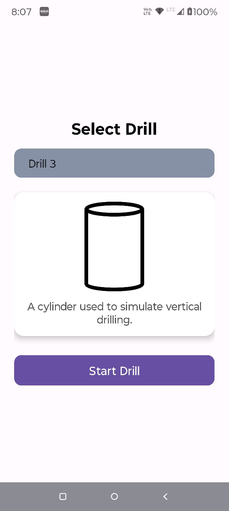
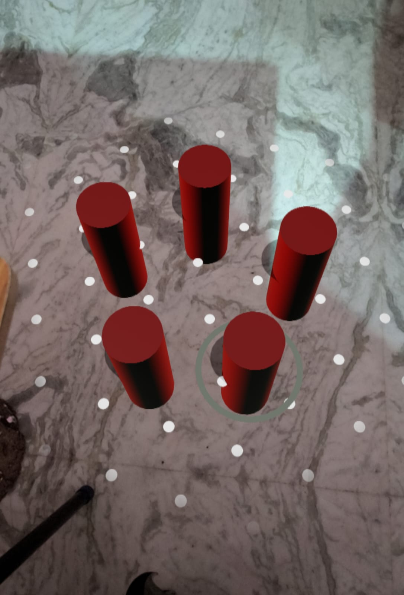

# 🔩 AR Drill Model App

This is an Android app built using **Java/Kotlin + ARCore** that allows users to select different 3D drill models and interact with them in Augmented Reality.

## 🚀 Features

- 🎯 **Drill Selection**: Choose from predefined 3D drill types (cube, sphere, cylinder).
- 🖼️ **Live Preview**: View the selected drill’s image and description.
- 🕹️ **AR Visualization**: Start an AR session to visualize the selected model.
- 📱 **Clean UI**: Responsive XML layout with spinner, dynamic image, and material buttons.

## 🧱 Tech Stack

| Tool/Tech          | Purpose                             |
|--------------------|-------------------------------------|
| Kotlin / Java      | Main app logic                      |
| XML Layout         | UI design                           |
| ARCore             | Augmented Reality implementation    |
| Android SDK 34     | App build and compatibility         |
| Material Components| Modern UI widgets                   |

## 📸 Screenshots

| Drill Selection | AR View |
|----------------|---------|
|  |  |

## 🛠️ Getting Started

### Prerequisites

- Android Studio Dolphin or later
- Android device with ARCore support
- minSdkVersion = 24

### Setup Instructions

1. Clone the repo:
    ```bash
    git clone https://github.com/yourusername/ar-drill-model.git
    cd ar-drill-model
    ```

2. Open the project in Android Studio.

3. Add your `3D models` to `assets/` or use default ones supported by ARCore.

4. Build and run on a real AR-supported device.

### Important Files

- `DrillSelectionActivity.kt` — UI to select drills.
- `ARView.kt` — Loads the selected 3D model into the AR scene.
- `res/layout/activity_drill_selection.xml` — Spinner + image + description UI.

## 📦 Future Enhancements

- Add support for importing custom 3D models.
- Add tap interaction in AR view.
- Implement drill rotation and scaling.
- Add camera snapshot feature.

## 📄 License

This project is licensed under the MIT License - see the [LICENSE](LICENSE) file for details.
